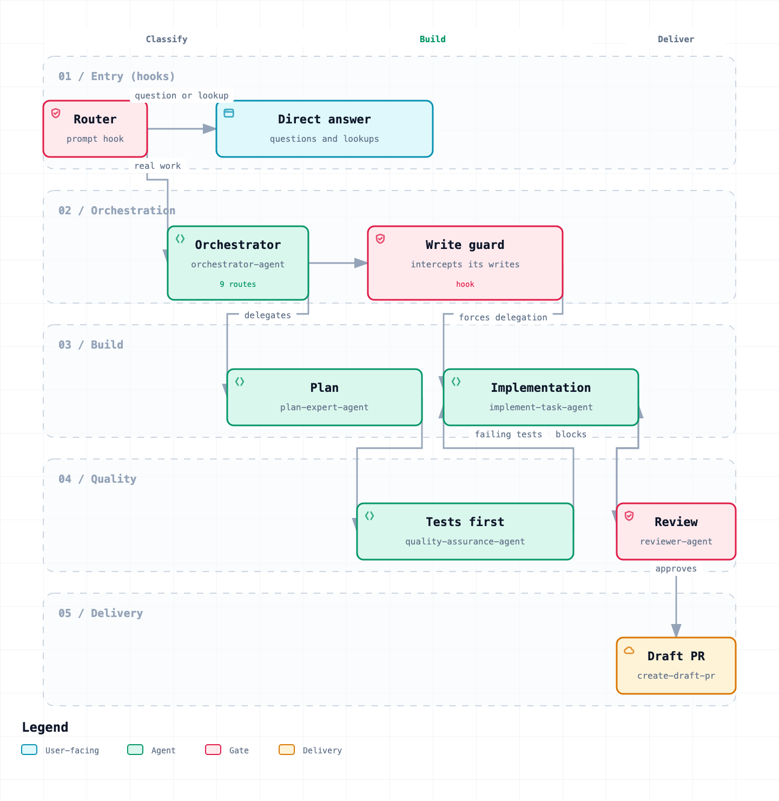

# Dev Workflow — Claude Code Plugin

A Claude Code plugin with a curated set of skills and agents for software teams. Covers accessibility auditing, code review, project initialization, design system documentation, and end-to-end feature planning workflows backed by ClickUp.

---

## How the network fits together



A prompt meets three gates on its way to a pull request, and each one exists to
stop a specific waste:

- **Router** (`orchestrator-router.js`, a `UserPromptSubmit` hook) reads the
  prompt and stays out of the way for questions, lookups and one-line edits.
  For engineering work it classifies the intent and suggests the right workflow
  pipeline.
- **Guard** (`orchestrator-guard.js`, a `PreToolUse` hook) intercepts the
  orchestrator's own writes, so routing work and doing work stay separate
  jobs.
- **Reviewer** (`reviewer-agent`) reads the diff with no stake in having
  written it, and can send the work back before a PR exists.

### Workflow pipelines (v2.0)

Multi-step engineering routes now run as **deterministic Workflow scripts**
instead of model-driven orchestrator delegation. Each script encodes a pipeline
(e.g., plan → test → implement → review → PR) as plain JavaScript with
structured schemas for data passing and a review retry loop.

| Workflow | Pipeline | When |
|---|---|---|
| `quick-task.js` | plan → test → implement → review → PR | Well-defined task, often with a ticket ID |
| `implement.js` | test → implement → review → PR | Plan already exists |
| `refactor.js` | plan → implement → review → PR | Restructuring without behavior change |
| `bug-fix.js` | reproduce → fix → review → PR | Bug reports and regressions |

The scripts live in `workflows/` and are invoked via the `Workflow` tool:

```
Workflow({ scriptPath: "<plugin_root>/workflows/quick-task.js",
           args: { description: "...", ticketId: "CU-xxx" } })
```

The router hook suggests the right workflow automatically. Single-hop routes
(feature discovery, design system, code review, a11y audit, wiki) still use
the Agent or Skill tool directly — a workflow adds no value for a single step.

Each workflow references the plugin's agent definitions via `agentType` (e.g.,
`axis-human-ai-toolbox:plan-expert-agent`), so the agents' full system prompts,
skills, and tool access apply inside the pipeline.

The diagram is generated, not drawn by hand: `docs/agent-network.workflow.json`
is the source, and `docs/agent-network.html` is the same diagram as an
explorable page with search, focus and relationship tracing.

---

## What's inside

### Skills

Skills are reusable workflows invoked with a `/` command directly in Claude Code. Each skill is independent and can be used on its own.

| Skill                   | Command                | What it does                                                                                                                                                                                                                                                                               |
| ----------------------- | ---------------------- | ------------------------------------------------------------------------------------------------------------------------------------------------------------------------------------------------------------------------------------------------------------------------------------------ |
| **init-project**        | `/init-project`        | Scans the codebase and generates an `AGENTS.md` with the detected stack, structure, and dev commands. Run this first on any new project.                                                                                                                                                   |
| **code-review**         | `/code-review`         | Two-phase code review: fast pre-commit checks (spec compliance, type safety, security) followed by a deep SOLID / KISS / DRY structural audit.                                                                                                                                             |
| **a11y-auditor**        | `/a11y-auditor`        | Audits code or components for accessibility barriers against WCAG 2.2 (A, AA, AAA). Auto-detects web vs. mobile stack.                                                                                                                                                                     |
| **plan-expert**         | `/plan-expert`         | Takes a ClickUp ticket or a free-form description and breaks it into detailed, ordered subtasks using a structured 8-section template. Creates subtasks on the ClickUp ticket or as a local task list.                                                                                     |
| **design-expert**       | `/design-expert`       | Scans the project for all design-related information (colors, typography, spacing, component patterns, dark mode, design system) and generates or updates a `DESIGN.md` file.                                                                                                              |
| **design-system-docs**  | `/design-system-docs`  | Audits design system documentation. If Storybook is present, reviews its quality and suggests improvements. If not, produces a step-by-step plan to implement it.                                                                                                                          |
| **design-system-setup** | `/design-system-setup` | End-to-end design system setup. Runs `design-expert` → `design-system-docs` → `plan-expert` in sequence to document the design system, audit or plan Storybook, and create all execution tasks in ClickUp or locally.                                                                      |
| **create-draft-pr**     | `/create-draft-pr`     | Creates a GitHub PR with a fully auto-populated standardized template. Infers base branch, derives description from the diff, detects shared code impact, tags stakeholders from CODEOWNERS, and builds a concrete test plan. Designed to run without human input when called by an agent. |
| **implement-task**      | `/implement-task`      | Implements a task end-to-end. Given a ClickUp ticket ID or description, reads project context, plans at the file level, writes the code, runs automated checks + `code-review`, applies fixes, commits, and opens a PR via `create-draft-pr`.                                              |

### Agents (sub-agents invoked by workflows)

Agents are sub-agent definitions invoked by workflow pipelines (via `agentType`) or by the `orchestrate` skill for single-hop routes. There is no orchestrator agent — the `orchestrate` skill and workflow scripts handle all routing.

| Agent                         | Activated when                                                                                           |
| ----------------------------- | -------------------------------------------------------------------------------------------------------- |
| **planning-features-agent**   | `new_feature` intent — structured requirement interviews → FEATURE_SPEC + ClickUp ticket.                |
| **plan-expert-agent**         | `quick_task`, `refactor` workflows — decomposes specs into 8-section subtasks.                           |
| **quality-assurance-agent**   | `quick_task`, `implementation` workflows — writes failing tests (TDD red phase).                         |
| **implement-task-agent**      | All multi-step workflows — writes code, runs review, commits.                                            |
| **reviewer-agent**            | All multi-step workflows — independent code quality and security review gate.                            |
| **bugfixer-agent**            | `bug` workflow — reproduces, isolates, and patches bugs with minimal scope.                              |
| **design-system-setup-agent** | `design_system` intent — design-expert → design-system-docs → plan-expert pipeline.                      |

> **How to use:** Just describe what you want in natural language. The router hook and `orchestrate` skill route to the correct workflow automatically. Use `/` skills for direct, one-off invocations when you know exactly which step to run.

### Standalone agents (Playwright test automation)

These three agents are **not** routed through the orchestrator. They form a self-contained end-to-end browser-testing pipeline and are invoked directly via `/agents` (or by naming them). They run against a live web app through the `playwright-test` MCP server.

| Agent                         | Role                                                                                                                                                                   |
| ----------------------------- | ---------------------------------------------------------------------------------------------------------------------------------------------------------------------- |
| **playwright-test-planner**   | Explores a running web app in a real browser, maps user flows, and writes a comprehensive Markdown test plan (happy paths, edge cases, negative scenarios).            |
| **playwright-test-generator** | Takes a test plan and generates Playwright `.spec.ts` files — executing each step live in the browser to produce robust, best-practice selectors and assertions.       |
| **playwright-test-healer**    | Runs the generated suite, debugs failing tests, fixes selectors/assertions/timing, and re-runs until green. Marks genuinely stuck-but-correct tests as `test.fixme()`. |

---

## Requirements

- [Claude Code](https://claude.ai/code) CLI installed
- A ClickUp account with API access (for skills that create/read tickets)
- A GitHub personal access token (for the GitHub MCP server)

---

## Installation

### Option 1 — One-line install (recommended)

Run this from your terminal — no cloning or manual steps required:

```bash
curl -fsSL https://raw.githubusercontent.com/Axis-Human/dev-workflow-plugin/main/install.sh | bash
```

This installs the plugin and configures the required hooks in `~/.claude/settings.json` automatically.

---

### Option 2 — Install directly via Claude Code (no cloning required)

Point Claude Code to the GitHub repository URL and it will install the plugin automatically:

```bash
claude
```

```bash
/plugin marketplace add axis-human/dev-workflow-plugin
```

Claude Code fetches the plugin from GitHub and keeps it available. To update to the latest version at any time:

```bash
claude plugins update axis-human-ai-toolbox
```

---

### Option 3 — Clone and install locally

Use this option if you want to modify skills or develop your own on top of this plugin.

**1. Clone the repository**

Pick a permanent location on your machine — this folder needs to stay there as long as you want the plugin active.

```bash
git clone https://github.com/Axis-Human/dev-workflow-plugin ~/tools/axis-human-ai-toolbox
```

**2. Register the plugin with Claude Code**

```bash
claude /plugin marketplace add ~/tools/axis-human-ai-toolbox
claude plugins enable axis-human-ai-toolbox
```

Or open `~/.claude/settings.json` and add it manually:

```json
{
	"enabledPlugins": {
		"axis-human-ai-toolbox": true
	}
}
```

**3. Keep it up to date**

Since the plugin runs from your local clone, updating is a regular `git pull`:

```bash
cd ~/tools/axis-human-ai-toolbox && git pull
```

---

### Verify the setup

Open Claude Code in any project and run:

```
/init-project
```

If the skill runs and produces an `AGENTS.md` file, the plugin is working.

---

## Usage

### Skills

All skills accept optional arguments. Run without arguments and the skill will ask for what it needs.

```bash
# Scan the project and generate AGENTS.md
/init-project

# Review only files changed against main
/code-review --base-branch main

# Audit for WCAG AA compliance (default)
/a11y-auditor

# Audit for WCAG AAA compliance
/a11y-auditor --level AAA

# Plan from a ClickUp ticket
/plan-expert --ticket-id abc123xyz

# Plan from a description
/plan-expert --description "Build a user authentication flow with email and OAuth"

# Document the project's design system
/design-expert

# Audit or plan Storybook documentation
/design-system-docs

# Full design system setup (design-expert + design-system-docs + plan-expert)
/design-system-setup

# Create a PR with auto-populated template from the current branch diff
/create-draft-pr

# Create a PR targeting a specific base branch
/create-draft-pr --base develop

# Implement a task from a ClickUp ticket and open a PR
/implement-task --ticket-id abc123xyz

# Implement a task from a description (runs plan-expert first, then implements)
/implement-task --description "Add email validation to the signup form"
```

### Workflow pipelines

Describe the task in natural language and the router hook + `orchestrate` skill
automatically launch the right workflow pipeline:

```
# Quick task (plan → test → implement → review → PR)
"Implement ticket CU-abc123"
"Work on this task and open a PR when done"

# Bug fix (reproduce → fix → review → PR)
"The login endpoint returns 500 when the email contains a plus sign"

# Refactor (plan → implement → review → PR)
"Refactor the auth middleware to use the new session store"

# Feature planning (single-hop — discovery interview)
"I want to plan a new feature"
"Let's plan the user notification system"
```

You can also invoke the orchestrate skill directly: `/orchestrate`

### Playwright test automation workflow

The three Playwright agents chain into a **plan → generate → heal** pipeline that builds and maintains an end-to-end test suite for a live web app — no manual test writing required.

```
playwright-test-planner  →  playwright-test-generator  →  playwright-test-healer
   (explore + plan)            (write .spec.ts files)        (run + debug until green)
```

**Prerequisites**

- Playwright installed in the target project (`npm install -D @playwright/test && npx playwright install`).
- The `playwright-test` MCP server (declared in `.mcp.json`). It launches via `npx playwright run-test-mcp-server` and works on macOS, Linux, and Windows out of the box.
  > **Windows note:** if `npx` isn't resolved when the server spawns, wrap it through `cmd`:
  >
  > ```json
  > "playwright-test": { "command": "cmd", "args": ["/c", "npx", "playwright", "run-test-mcp-server"] }
  > ```
- A running instance of the app under test (the planner navigates to it in a browser).

**How to run it**

Invoke each agent in order via `/agents`, or just describe the step in natural language:

```
# 1. Explore the app and produce a test plan
"Use playwright-test-planner to create a test plan for http://localhost:3000"

# 2. Turn the plan into Playwright spec files
"Use playwright-test-generator to generate tests from the saved plan"

# 3. Run the suite and fix any failures
"Use playwright-test-healer to run the tests and fix what's broken"
```

Each step hands off to the next: the planner saves a Markdown plan, the generator reads that plan and writes one `.spec.ts` per scenario, and the healer runs the suite and repairs failing tests (marking any it can't fix as `test.fixme()` with an explanatory comment). You can also run the healer on its own any time tests start failing after app changes.

---

## Project structure

```
axis-human-ai-toolbox/
├── .claude-plugin/
│   └── plugin.json                      # Plugin metadata
├── docs/
│   ├── agent-network.workflow.json      # Source of the network diagram
│   ├── agent-network.png                # Rendered diagram, embedded in this README
│   └── agent-network.html               # Same diagram, explorable
├── workflows/
│   ├── quick-task.js                    # plan → test → implement → review → PR
│   ├── implement.js                     # test → implement → review → PR
│   ├── refactor.js                      # plan → implement → review → PR
│   └── bug-fix.js                       # reproduce → fix → review → PR
├── agents/
│   ├── planning-features-agent.md       # Sub-agent: requirement discovery interviews
│   ├── plan-expert-agent.md             # Sub-agent: technical decomposition
│   ├── quality-assurance.md             # Sub-agent: TDD red phase tests
│   ├── implement-task-agent.md          # Sub-agent: code + PR delivery
│   ├── reviewer-agent.md               # Sub-agent: independent review gate
│   ├── bugfixer-agent.md               # Sub-agent: reproduce + minimal patch
│   ├── design-system-setup-agent.md     # Sub-agent: design system pipeline
│   ├── wiki-agent.md                    # Sub-agent: project wiki management
│   ├── playwright-test-planner.md       # Standalone: explore app → test plan
│   ├── playwright-test-generator.md     # Standalone: test plan → .spec.ts files
│   └── playwright-test-healer.md        # Standalone: run + fix failing tests
├── skills/
│   ├── orchestrate/
│   │   └── SKILL.md                     # Central router — classifies and dispatches
│   ├── a11y-auditor/
│   │   └── SKILL.md
│   ├── code-review/
│   │   └── SKILL.md
│   ├── create-draft-pr/
│   │   └── SKILL.md
│   ├── design-expert/
│   │   └── SKILL.md
│   ├── design-system-docs/
│   │   └── SKILL.md
│   ├── design-system-setup/
│   │   └── SKILL.md
│   ├── implement-task/
│   │   └── SKILL.md
│   ├── init-project/
│   │   └── SKILL.md
│   └── plan-expert/
│       └── SKILL.md
├── hooks/
│   ├── hooks.json                       # Which hook runs on which event
│   ├── orchestrator-router.js           # UserPromptSubmit: classify and suggest workflow
│   ├── orchestrator-guard.js            # PreToolUse: defense-in-depth write guard
│   └── telemetry.js                     # Turn/agent/session usage → dashboard
└── README.md
```

---

## Adding a new skill

1. Create a new directory under `skills/`:

   ```bash
   mkdir skills/my-skill
   ```

2. Create `skills/my-skill/SKILL.md` with this frontmatter:

   ```markdown
   ---
   name: my-skill
   description: One-line description of when and why to use this skill.
   argument-hint: [--option <value>]
   allowed-tools: Read Grep Glob Bash AskUserQuestion
   effort: low|medium|high
   ---

   # my-skill

   Instructions for Claude to follow when this skill is invoked...
   ```

3. The skill is immediately available as `/my-skill` in any project where this plugin is enabled.

---

## Adding a new agent

1. Create a new file under `agents/`:

   ```bash
   touch agents/my-agent.md
   ```

2. Write the agent file with this frontmatter:

   ```markdown
   ---
   name: my-agent
   description: >
     Sub-agent: invoked only by the orchestrator-agent when [X intent] is detected.
     [What it does]. Do not invoke directly.
   model: claude-opus-4-6
   color: blue
   effort: medium
   tools:
     - AskUserQuestion
     - Read
     - Bash
   skills:
     - skill-one
     - skill-two
   ---

   Agent orchestration instructions...
   ```

   **Important:** All agents in this plugin are sub-agents invoked by workflows or the
   `orchestrate` skill. New agents must be registered in the skill's routing table
   (`skills/orchestrate/SKILL.md`) and in any workflow script that should use them.

3. Use the `skills` frontmatter field to preload skills. This ensures skills execute inline in the agent's context rather than being delegated to a subagent.

> **Note:** If you want the workflow to also be available as a `/` command, create a matching skill under `skills/my-agent/SKILL.md` with `allowed-tools` instead of `tools` and the same body. Both files can coexist — the agent handles auto-selection, the skill handles direct invocation.

---

## Usage telemetry

The plugin can report what each turn actually cost — tokens, model, wall time,
which sub-agent ran, and against which ClickUp ticket — to the AH Dashboard, so
the numbers can be optimised instead of guessed at.

**There is nothing to set up.** Install the plugin and it works — no token to
paste, no variable to export, no file to edit.

### How a machine gets permission

This repo is public, so it carries no secret: a credential in a public repo is
not a credential. Instead each machine generates its own the first time it runs
— 32 random bytes in `~/.claude/ai-usage/device.json`, mode 0600 — and presents
it on every request.

Generating one is not the same as being allowed to use it:

1. The machine reports for the first time and is parked as **pending**. Nothing
   it sends is stored.
2. It shows up under **Uso de IA** in the dashboard, labelled with its GitHub
   login and hostname, with a badge on the nav item so the queue is visible.
3. Someone approves it once. From then on its records land — **including
   everything it reported while waiting**, which the collector kept in its
   spool.

Blocking a machine there stops it for good: it is told 403, writes a local
marker and stops collecting altogether rather than retrying forever.

Optionally pin a ticket by hand when the branch does not carry one:

```sh
export AI_TELEMETRY_TICKET='86abc9xyz'
```

### What is collected

| Field | Source |
|---|---|
| Tokens (in, out, cache read, cache creation, thinking) | The session transcript's `usage` block |
| Model, and every model a turn touched | Same |
| Wall time, tool call count | Hook timestamps, `tool_use` blocks |
| Sub-agent name and its own token usage | `SubagentStop` + that agent's transcript |
| Cost in USD, lines added/removed | Claude Code's own `cost-state` at session end |
| GitHub account of the machine | `gh auth status`, cached for a day |
| ClickUp ticket | Branch name, or an id named in the prompt, or `AI_TELEMETRY_TICKET` |
| Prompt length and SHA-256 | The prompt — **the text itself is never collected** |

Prompt text is deliberately excluded. The dashboard is readable without a login,
and a prompt can carry client data, credentials or proprietary code. Length and
hash answer "which turn was expensive" and "is this the same prompt again"
without holding content.

Work with no detectable ticket is still recorded, with a null ticket. Filtering
it out would make untracked spend — usually the largest slice — invisible.

### How it behaves when things break

- **Endpoint down, or machine not approved yet**: records spool to
  `~/.claude/ai-usage/` and the next flush retries them, oldest first. The turn
  never waits on the network — the POST happens in a detached child.
- **Never blocks a session**: every path exits 0. Errors go to
  `~/.claude/ai-usage/collector.log`, never to stdout, because on
  `UserPromptSubmit` stdout is injected into the model's context.
- **Server gone for a long time**: the spool stops growing past 5 MB rather than
  filling the disk.
- **Retries do not double-count**: the dashboard upserts on `(session_id,
  prompt_id)` for turns and on `agent_id` for sub-agent runs.

### Reading the numbers

The dashboard serves the report at `/ai-usage/<AI_USAGE_REPORT_TOKEN>` — no
login, so the link can be shared, but unguessable and `noindex`. That token only
reads: writing is gated by per-machine approval, so sharing the report can never
hand out permission to write to it.

## MCP servers

| Server            | Type  | Purpose                                                                                             |
| ----------------- | ----- | --------------------------------------------------------------------------------------------------- |
| `github`          | HTTP  | GitHub repository operations via the Copilot MCP endpoint                                           |
| `clickup`         | HTTP  | ClickUp task management — read tickets, create tasks and subtasks                                   |
| `playwright-test` | stdio | Browser automation for the Playwright test agents — explore apps, generate and run `.spec.ts` tests |

The MCP configuration is automatically picked up by Claude Code as a project-scoped config. Tokens are read from environment variables — never committed to the repo.
